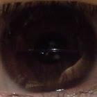

# Welcome to my personal WebPage

In this Webpage you can find all my personal projects

## estribo3d

En este vídeo presento el resultado de correr una Macro de Excel ([VBA](https://en.wikipedia.org/wiki/Visual_Basic_for_Applications)), que genera un estribo ([3DSolid](http://help.autodesk.com/view/ACD/2018/ENU/?guid=GUID-4EC0355F-A91B-4ADA-A346-05CCCD22259B#GUID-4EC0355F-A91B-4ADA-A346-05CCCD22259B)) en AutoCAD.

## pdftoExcel

En este vídeo presento el resultado de correr un script de [python](http://python.org) para convertir archivos [pdf](https://en.wikipedia.org/wiki/PDF/A) usando el [API](https://en.wikipedia.org/wiki/Application_programming_interface) de [Adobe Acrobat](https://www.adobe.com/devnet/acrobat.html).

## About me
I am a Civil Engineer of [Universidad Nacional de Colombia](http://unal.edu.co) and student of Master in Structures at same University.

I love programming Civil Engineering stuff.

Next you will find me in the network:

1. GitHub: [rvcristiand](https://github.com/rvcristiand).
2. Mail: [rvcristiand@gmail.com](mailto:rvcristiand@gmail.com).
3. CVLac: [Cristian Danilo Ramirez Vargas](http://scienti.colciencias.gov.co:8081/cvlac/visualizador/generarCurriculoCv.do?cod_rh=0000122390).
